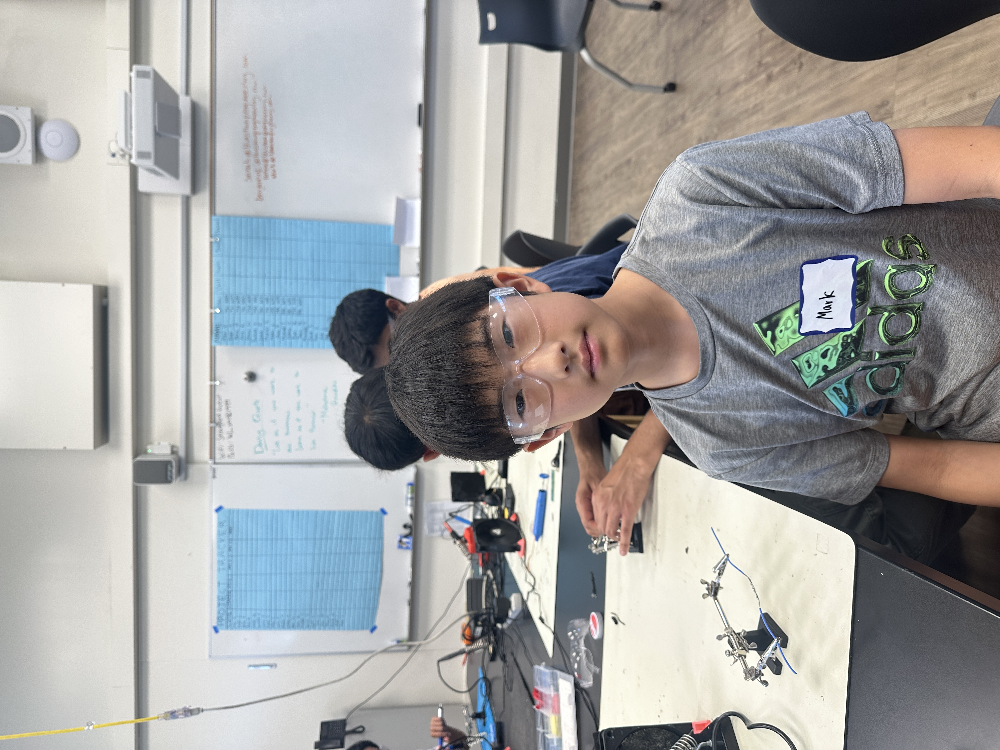

# Self Driving Robotic Car
In the United States, over six and a half million car accidents happen every year. Over 90% of those accidents are caused by human pilot
error, according to the U.S. General Services Administration. A car that operates on artificial intelligence and is attentive 100% of the
time can drastically reduce the number of vehicle accidents every year. This is one of the reasons of why I want to build the self driving 
car. 

| **Engineer** | **School** | **Area of Interest** | **Grade** |
|:--:|:--:|:--:|:--:|
| Mark L | Stratford Preparatory | Mechanical/Aerospace Engineering | Incoming 7th Grader



# Final Milestone

<iframe width="560" height="315" src="https://www.youtube.com/embed/1Tj2NyR4g1s?si=08hiQw-EOnpeLCCK" title="YouTube video player" frameborder="0" allow="accelerometer; autoplay; clipboard-write; encrypted-media; gyroscope; picture-in-picture; web-share" referrerpolicy="strict-origin-when-cross-origin" allowfullscreen></iframe>

Since my second milestone, I finished coding the infrared sensors and the obstacle detection. One of the greatest challenges was making sure that one feature wouldn't break another. For example, adding two 5V light strips caused too much load on the 9V battery, so I had to reroute the wiring to a second battery that I added later on to power the aesthetic components. During my time at Bluestamp, I learned about critical electrical concepts such as Ohm's law, using a multimeter, and wiring concepts. Ohm's law states that the voltage is equivalent to the current (in amperes) multiplied by the resistance (in Ohms, named after him.) Multimeters are called MULTImeters for a reason; they can do many things. Not only can they detect short circuits in the circuit, but can also be used to measure voltage and output the results on a seven-segment display. Simple wiring through a breadboard generally consists of a red (positive) power wire and a black or brown (negative) ground wire. The red wire supplies power and ground makes sure that the power doesn't blow up the circuit by creating a point through which excess electricity can escape and nothing sets on fire. In the future, I hope to learn more about my interests and do more complicated projects now that I know the basics.

# Second Milestone

<iframe width="560" height="315" src="https://www.youtube.com/embed/LvG_XtgDk1o?si=GcD0zFd1mAOB8xgC" title="YouTube video player" frameborder="0" allow="accelerometer; autoplay; clipboard-write; encrypted-media; gyroscope; picture-in-picture; web-share" referrerpolicy="strict-origin-when-cross-origin" allowfullscreen></iframe>

From the first milestone, not much has changed on the physical side, but in terms of software, I've added a preprogrammed loop that makes the motors run and thus the car move. I think the most fun part about the project is designing custom parts like an external switch connected to the battery, which involves soldering which is one of the things that I have not done a lot. I thought that connecting the L298N module to the board was impossible and extremely time intensive, involving drilling holes. However, I realized that I can just attach the wires and 3d design a custom adapter for the module to fit on the pre drilled holes of my board. I need to finish coding the obstacle avoidance features in order for my project to be officially considered a self driving car.

# First Milestone

<iframe width="560" height="315" src="https://www.youtube.com/embed/KbAKzpfG8K0?si=2EWMpHW01JAYsbqv" title="YouTube video player" frameborder="0" allow="accelerometer; autoplay; clipboard-write; encrypted-media; gyroscope; picture-in-picture; web-share" referrerpolicy="strict-origin-when-cross-origin" allowfullscreen></iframe>

The microcontroller is the head of the car: it sends commands to the rest of the components, in addition to supplying power. The general concept is that the ultrasonic and infrared sensors sent signals to the microcontroller which then send signals to the motor driver and then the motors. I have finished building the car and wiring everything together. The L928N module requires an adapter, and I'm still working on printing it. Now it's just about coding the self driving features and implementing a remote control switch system to manually control the car.

# Schematics 


# Code
Here's where you'll put your code. The syntax below places it into a block of code. Follow the guide [here]([url](https://www.markdownguide.org/extended-syntax/)) to learn how to customize it to your project needs. 

```c++
const int in1 = 5;
const int in2 = 6;
const int in3 = 9;
const int in4 = 10;

const int rightIR = 7;
const int leftIR = 8;

void setup() {
  Serial.begin(9600);

  //motor
  pinMode(in1, OUTPUT);
  pinMode(in2, OUTPUT);
  pinMode(in3, OUTPUT);
  pinMode(in4, OUTPUT);

  //IR obstacle
  pinMode(leftIR, INPUT);
  pinMode(rightIR, INPUT);

}

void loop() {

  int left = digitalRead(leftIR);  // 0: Obstructed   1: Empty
  int right = digitalRead(rightIR);
  int speed = 150;

  if (!left && right) {
    backLeft(speed);
  } else if (left && !right) {
    backRight(speed);
  } else if (!left && !right) {
    moveBackward(speed);
  } else {
    moveForward(speed);
  }
}

void moveForward(int speed) {
  analogWrite(in1, 0);
  analogWrite(in2, speed);
  analogWrite(in3, speed);
  analogWrite(in4, 0);
}

void moveBackward(int speed) {
  analogWrite(in1, speed);
  analogWrite(in2, 0);
  analogWrite(in3, 0);
  analogWrite(in4, speed);
}

void backLeft(int speed) {
  analogWrite(in1, speed);
  analogWrite(in2, 0);
  analogWrite(in3, 0);
  analogWrite(in4, 0);
}

void backRight(int speed) {
  analogWrite(in1, 0);
  analogWrite(in2, 0);
  analogWrite(in3, 0);
  analogWrite(in4, speed);
}

```

# Bill of Materials

| **Part** | **Description** | **Price** | **Link** |
|:--:|:--:|:--:|:--:|
| SunFounder R3 Board | Microcontroller | 15.99 | <a href="https://www.sunfounder.com/products/arduino-unor3-control-board"> Sunfounder </a> |
| L298N Module | Motor Driver | 6.99 | <a href="https://www.sunfounder.com/products/l298n-motor-driver-board"> Sunfounder </a> |
| TT Motor | Motor/Main Propulsion | 8.88 | <a href="https://www.amazon.com/Wishiot-2pcs-DC3-6V-Motor-Reduction/dp/B07VBXXT9M/ref=sr_1_6?crid=9EWJOGQ6ME61&dib=eyJ2IjoiMSJ9.yoxb_qM_lXKGkbdWCflA79t88uxHUir1dSeKNdbO5S2zAusmSWVBNZAq_UB3WvBlwFu3_Snl1zz0H43mtqkquAsQMBEYHANJfDmr1__H0xLgEjSFuI5Uqxw_REBxbFS4ksy8gQP5d-IpQj3Ar2oXSDmOd7UGGBuGNnc3NBND6R6n9ccBzYKWzqOxqtZaJIZRhdc-_k1EhnpD51P5FNeY7Ffxfi6K3uR0c3WprGpiedfzBv9dRrhFO1Ccq2kuyvJVQ-AfdJUMRcsrxlZDOuA2Pk6jiMoBse_hdDaaDbplf_A.C2V4VeYSqoytwuzl5VbcriSn6KMISLZcmYwi4U5A22g&dib_tag=se&keywords=tt+motor&qid=1718743027&s=industrial&sprefix=tt+motor%2Cindustrial%2C133&sr=1-6"> Amazon </a> |
| FC-51 Module | Infrared Sensor | 8.99 | <a href="https://www.amazon.com/ALMOCN-Infrared-Obstacle-Avoidance-Raspberry/dp/B08ZMJGKQP/ref=sr_1_15?crid=19UUMAOAS76Q9&dib=eyJ2IjoiMSJ9.2SYg7ZngTzI3kV3jYMQbeoQveQACXH5_b3CRBBWVW1x_kNlywPaRAJ_PTJ6oPY2q-DUClHKUjYl6ZpcNQLPXEKu867TGuBM0wNwJ3hiQMBa25ESKUnvE2mN77JhgGFXtJJzab5h8_Uu2Ly5v73qwNxMMvYpWrswW5SB9RQ5yVeXsrLhkWGZQ2UqwlkJsArE-9SnV1ssFYPy6ANCptEGdsdfURJar9Cv2Q2vEM5dMz4mGQ8BW1VuPVhlDeWv0S6Qh4zUST9i3erZpyejEIokC-3zITgLdMf9rlqtnrsB03kM.UxvVeUpxsl3QbaVVhUdt1KDcI2JOQuOjC_FE0qOPK2g&dib_tag=se&keywords=obstacle+avoidance+module&qid=1718743405&s=electronics&sprefix=obstacle+avoidance+moudle%2Celectronics%2C122&sr=1-15"> Amazon </a> |
| Tiny Premium Breadboard | Solderless Circuitboard | 3.95 | <a href="https://www.adafruit.com/product/65"> Adafruit </a> |

# Starter Project

<iframe width="560" height="315" src="https://www.youtube.com/embed/qB56Gisgcb0?si=aOHxcnctfWgcvuFH" title="YouTube video player" frameborder="0" allow="accelerometer; autoplay; clipboard-write; encrypted-media; gyroscope; picture-in-picture; web-share" referrerpolicy="strict-origin-when-cross-origin" allowfullscreen></iframe>

This is my starter project. I practiced soldering by putting together a cool color mixing experiment/lab with RGB. The kit came with 5 pieces: a 4-pin RGB LED, a mini white PCB with pre-cut holes, and three linear potentiometers. Soldering was difficult at first, but with practice I started to get the hang of it. I believe that learning to solder will greatly benefit me in making my final project.
